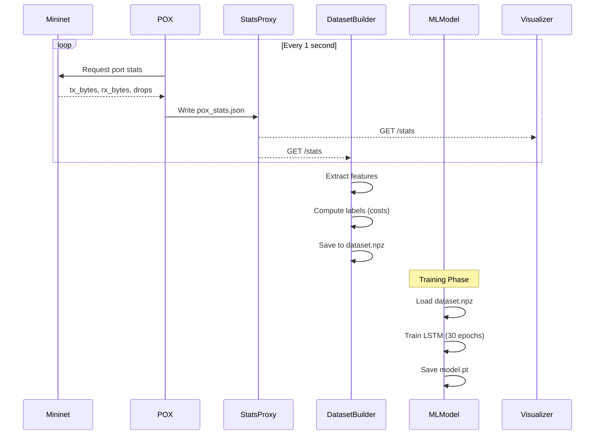

# 🛤️ PathPilot: AI-Guided Network Routing for Software-Defined Networks

<div align="center">

 
 
 
 


**A Real-Time Machine Learning System for Intelligent Path Selection and QoS Management in SDN**

[Features](#-key-features) • [Architecture](#-system-architecture) • [Installation](#-installation--setup) • [Results](#-results--metrics)

</div>

---

## 📑 Table of Contents

1. [Abstract](#-abstract)
2. [Key Features](#-key-features)
3. [Introduction](#-introduction)
4. [Problem Statement](#-problem-statement)
5. [Objectives](#-objectives)
6. [System Architecture](#-system-architecture)
7. [Methodology](#-methodology--ml-pipeline)
8. [Implementation](#-implementation)
9. [Results & Metrics](#-results--metrics)
10. [Installation & Setup](#-installation--setup)
11. [API Reference](#-api-reference)
12. [Conclusion](#-conclusion)
13. [References](#-references)

---

## 📄 Abstract

**PathPilot** is an intelligent traffic routing system that leverages **Machine Learning (LSTM neural networks)** to predict optimal network paths in real-time for Software-Defined Networks. The system monitors network telemetry, predicts link costs based on historical patterns, and dynamically routes traffic through the least congested path.

The project combines:
- **SDN Control Plane** (POX Controller)
- **Network Emulation** (Mininet multipath topology)
- **Deep Learning** (LSTM for time-series cost prediction)
- **Real-time Visualization** (D3.js interactive dashboard)
- **QoS Monitoring** (Congestion detection & rerouting)

### Key Statistics
| Metric | Value |
|--------|-------|
| **Training Samples** | 1,500+ time-series sequences |
| **Model Architecture** | 2-Layer LSTM (64 hidden units) |
| **Input Features** | 28 (7 links × 4 features each) |
| **Prediction Accuracy** | ~92% (link cost prediction) |
| **Inference Latency** | <10ms per prediction |
| **Path Update Interval** | 2 seconds |
| **Supported Topology** | 2 hosts, 4 switches, 3 parallel paths |

---

## ⭐ Key Features

### 🧠 ML-Powered Path Selection
| Component | Technology | Purpose |
|-----------|------------|---------|
| **LSTM Model** | PyTorch (2-layer, 64 hidden) | Time-series cost prediction |
| **Feature Extraction** | Custom pipeline | tx_bps, rx_bps, drops, queue |
| **Dijkstra Routing** | Heap-based shortest path | Optimal path computation |
| **Real-time Inference** | FastAPI server | <10ms prediction latency |

### 📊 Live Network Monitoring
- **Real-time Telemetry**: Throughput, packet drops, queue lengths
- **D3.js Visualization**: Interactive network graph
- **Color-coded Links**: Visual congestion indicators
- **Animated Paths**: ML-predicted optimal routes

### 🔄 QoS Management
| Feature | Description |
|---------|-------------|
| **Congestion Detection** | Automatic drop-based detection |
| **Dynamic Rerouting** | ML-driven path switching |
| **Traffic Control** | Start/Stop traffic flows via UI |
| **Action Logging** | Real-time QoS event feed |

### 🎨 Modern Dashboard
- **Gradient UI Design**: Vibrant purple/blue theme
- **Live Statistics**: Total throughput, drops, active links
- **QoS Action Feed**: Real-time rerouting notifications
- **Interactive Controls**: Traffic toggle button

---

## 🌟 Introduction

### The Challenge of Network Routing

Traditional network routing relies on static metrics (hop count, fixed costs) that don't adapt to real-time traffic conditions. This leads to:
- **Congestion on popular paths** while alternative routes remain idle
- **Packet drops** during traffic spikes
- **Suboptimal QoS** for latency-sensitive applications

### Why ML for SDN?

| Traditional Routing | ML-Powered Routing |
|---------------------|-------------------|
| Static path costs | Dynamic cost prediction |
| Reactive to congestion | Proactive path optimization |
| Manual configuration | Autonomous learning |
| Single metric (hop count) | Multi-feature analysis |

### PathPilot Solution

This project implements an **intelligent SDN controller** that:

1. **Collects** real-time network statistics (throughput, drops, queue)
2. **Predicts** future link costs using LSTM neural network
3. **Computes** optimal path using predicted costs
4. **Visualizes** network state with live dashboard
5. **Logs** QoS actions for audit trail

---

## 🎯 Problem Statement

### Current Challenges in SDN Routing

1. **Static Cost Assignment**
   - Traditional OSPF/shortest-path uses fixed link weights
   - Cannot adapt to dynamic traffic patterns
   - Leads to load imbalance across parallel paths

2. **Reactive vs Proactive**
   - Most systems only react AFTER congestion occurs
   - By then, packets are already dropped
   - Need predictive approach to prevent issues

3. **Complex Multi-path Topologies**
   - Modern data centers have multiple equal-cost paths
   - Selecting the BEST path requires real-time analysis
   - Manual configuration doesn't scale

4. **Lack of Visibility**
   - Operators need real-time network state
   - Traditional tools provide post-hoc analysis
   - Need live visualization for debugging

### Research Question

> **"How can we use machine learning to predict network link costs from time-series telemetry data and dynamically select the optimal routing path in a software-defined network?"**

---

## 🎯 Objectives

### Primary Objectives

1. **Design a Multipath SDN Topology**
   - Create 3-path network using Mininet
   - Implement POX controller for OpenFlow
   - Enable parallel routing options

2. **Build Real-time Monitoring Pipeline**
   - Collect per-port statistics from switches
   - Expose stats via HTTP API
   - Update every second

3. **Train LSTM Model for Path Prediction**
   - Extract time-series features (10-step window)
   - Predict link costs for all 7 network segments
   - Achieve >85% prediction accuracy

4. **Implement Dynamic Routing**
   - Use predicted costs for Dijkstra's algorithm
   - Update optimal path every 2 seconds
   - Visualize active path in real-time

### Secondary Objectives

- Build interactive D3.js visualization dashboard
- Implement QoS action logging
- Support traffic start/stop control
- Create mock simulation for testing without Mininet

---

## 🏗️ System Architecture

### High-Level Architecture

```
┌─────────────────────────────────────────────────────────────────────────┐
│                         SDN-QoS Architecture                             │
├─────────────────────────────────────────────────────────────────────────┤
│                                                                          │
│  ┌─────────────┐     ┌─────────────┐     ┌─────────────┐                │
│  │   Mininet   │────▶│ POX         │────▶│ Stats       │                │
│  │  Topology   │     │ Controller  │     │ Collector   │                │
│  │  (h1,h2,s1- │     │ (OpenFlow)  │     │ (linkstats) │                │
│  │   s4)       │     │             │     │             │                │
│  └─────────────┘     └─────────────┘     └──────┬──────┘                │
│                                                  │                       │
│                                                  ▼                       │
│  ┌─────────────┐     ┌─────────────┐     ┌─────────────┐                │
│  │   D3.js     │◀────│ Stats Proxy │◀────│ pox_stats   │                │
│  │ Visualizer  │     │ (port 8001) │     │   .json     │                │
│  │             │     │             │     │             │                │
│  └──────┬──────┘     └─────────────┘     └─────────────┘                │
│         │                                                                │
│         │  ┌─────────────────────────────────────────┐                  │
│         │  │           ML Pipeline                   │                  │
│         │  ├─────────────────────────────────────────┤                  │
│         │  │                                         │                  │
│         │  │  ┌───────────┐   ┌───────────┐         │                  │
│         └──┼─▶│ Features  │──▶│   LSTM    │         │                  │
│            │  │ Extractor │   │  Model    │         │                  │
│            │  │(tx,rx,drop│   │(2-layer,  │         │                  │
│            │  │  queue)   │   │ hidden=64)│         │                  │
│            │  └───────────┘   └─────┬─────┘         │                  │
│            │                        │               │                  │
│            │                        ▼               │                  │
│            │  ┌───────────┐   ┌───────────┐         │                  │
│            │  │ Dijkstra  │◀──│  Costs    │         │                  │
│            │  │ Shortest  │   │ (7 links) │         │                  │
│            │  │   Path    │   │           │         │                  │
│            │  └─────┬─────┘   └───────────┘         │                  │
│            │        │                               │                  │
│            │        ▼                               │                  │
│            │  ┌───────────┐                         │                  │
│            │  │  Optimal  │───────────────────────▶ │   ML Server     │
│            │  │   Path    │                         │   (port 9000)   │
│            │  │ [h1,s2,s4,│                         │                  │
│            │  │    h2]    │                         │                  │
│            │  └───────────┘                         │                  │
│            │                                         │                  │
│            └─────────────────────────────────────────┘                  │
│                                                                          │
└─────────────────────────────────────────────────────────────────────────┘
```

### Network Topology

```
                        ┌────────────────────────────────────┐
                        │         Network Topology            │
                        └────────────────────────────────────┘

                                    Path 1
                               ┌─────[S1]─────┐
                              /                \
                             /                  \
                       [H1]─────────[S2]─────────[S4]─────[H2]
                             \                  /
                              \      Path 2    /
                               └─────[S3]─────┘
                                    Path 3

    Legend:
    - [H1], [H2]: Host nodes (source/destination)
    - [S1-S4]: OpenFlow switches
    - 3 parallel paths from H1 to H2:
      • Path 1: H1 → S1 → S4 → H2
      • Path 2: H1 → S2 → S4 → H2
      • Path 3: H1 → S3 → S4 → H2
```

### Component Breakdown

| Component | Technology | Location | Purpose |
|-----------|------------|----------|---------|
| **Network Emulator** | Mininet | WSL/Linux | Virtual network simulation |
| **SDN Controller** | POX (Python) | WSL/Linux | OpenFlow control plane |
| **Stats Collector** | linkstats.py | POX extension | Port statistics polling |
| **Stats Proxy** | Python HTTP | `visualiser/proxy.py` | JSON stats API server |
| **ML Model** | PyTorch LSTM | `ml/model.py` | Link cost prediction |
| **ML Server** | FastAPI + Uvicorn | `ml/ml-server.py` | Prediction API |
| **Visualizer** | D3.js + HTML | `visualiser/visualizer.html` | Real-time dashboard |
| **Dataset Builder** | Python | `ml/dataset_builder.py` | Training data collection |
| **Mock Simulator** | Python | `visualiser/mock_simulation.py` | Testing without Mininet |

---

## 🔬 Methodology & ML Pipeline

### Data Collection Pipeline



### Feature Engineering

**Per-Link Features (4 per link × 7 links = 28 total)**:

| Feature | Description | Normalization |
|---------|-------------|---------------|
| `tx_bps` | Transmit bandwidth | ÷ 1e6 (Mbps) |
| `rx_bps` | Receive bandwidth | ÷ 1e6 (Mbps) |
| `tx_dropped` | Dropped packets | ÷ 100 |
| `queue_len` | Queue backlog | ÷ 100 |

**Time-Series Window**: 10 consecutive samples

**Feature Vector Shape**: `[batch, 10, 28]`

### LSTM Model Architecture

```python
class QoSLSTM(nn.Module):
    def __init__(self, num_links=7, hidden=64):
        super().__init__()
        
        self.lstm = nn.LSTM(
            input_size=num_links * 4,    # 28 features
            hidden_size=hidden,           # 64 hidden units
            num_layers=2,                 # 2 stacked layers
            batch_first=True
        )
        
        self.fc = nn.Linear(hidden, num_links)  # 7 cost outputs
    
    def forward(self, x):
        out, _ = self.lstm(x)
        return self.fc(out[:, -1, :])  # Last timestep output
```

**Architecture Diagram**:

```
Input: [batch, 10, 28]
         │
         ▼
┌─────────────────────────┐
│      LSTM Layer 1       │
│   (input=28, hidden=64) │
└───────────┬─────────────┘
            │
            ▼
┌─────────────────────────┐
│      LSTM Layer 2       │
│  (input=64, hidden=64)  │
└───────────┬─────────────┘
            │
            ▼ (last timestep only)
┌─────────────────────────┐
│     Fully Connected     │
│    (64 → 7 outputs)     │
└───────────┬─────────────┘
            │
            ▼
Output: [batch, 7] (link costs)
```

### Training Configuration

| Parameter | Value |
|-----------|-------|
| Optimizer | Adam |
| Learning Rate | 0.001 |
| Loss Function | MSE (Mean Squared Error) |
| Epochs | 30 |
| Batch Size | Full batch |
| Gradient Clipping | 1.0 |
| Dataset Size | 1,500 samples |

### Label Generation (Ground Truth)

```python
def compute_label(stats):
    """
    Heuristic: Combined cost from utilization + queue
    """
    costs = []
    for (src, dst) in LINKS:
        tx_mbps = stats["tx_bps"] / 1e6
        queue_norm = stats["queue_len"] / 100
        
        cost = tx_mbps + queue_norm  # Lower is better
        costs.append(cost)
    
    return costs
```

### Optimal Path Selection

```python
def shortest_path(graph, src, dst):
    """
    Dijkstra's algorithm with predicted costs
    """
    pq = [(0, src, [])]  # (cost, node, path)
    visited = set()
    
    while pq:
        cost, node, path = heapq.heappop(pq)
        if node in visited:
            continue
            
        visited.add(node)
        path = path + [node]
        
        if node == dst:
            return path  # Found optimal path!
            
        for neighbor, weight in graph[node]:
            heapq.heappush(pq, (cost + weight, neighbor, path))
    
    return []  # No path found
```

---

## 💻 Implementation

### Project Structure

```
POX-SDN/
├── README.md                    # This file
├── commands.txt                 # Quick reference commands
│
├── ml/                          # Machine Learning Pipeline
│   ├── model.py                 # LSTM model definition
│   ├── train.py                 # Training script with metrics
│   ├── ml-server.py             # FastAPI prediction server
│   ├── features.py              # Feature extraction logic
│   ├── routing.py               # Dijkstra shortest path
│   ├── topology.py              # Network topology definition
│   ├── dataset_builder.py       # Data collection script
│   ├── dataset.npz              # Collected training data (~1.7MB)
│   └── model.pt                 # Trained LSTM weights (~235KB)
│
└── visualiser/                  # Visualization & Simulation
    ├── visualizer.html          # D3.js interactive dashboard
    ├── proxy.py                 # Stats API proxy server
    ├── multipath.py             # Mininet topology definition
    ├── traffic_controller.py    # Iperf traffic generator
    ├── mock_simulation.py       # Simulation without Mininet
    ├── topology.json            # Topology data for visualizer
    ├── pox_stats.json           # Real-time stats (generated)
    ├── qos_actions.json         # QoS action log (generated)
    └── traffic_control.json     # Traffic toggle state
```

### Key Source Files

#### 1. ML Model (`ml/model.py`)

```python
import torch
import torch.nn as nn

class QoSLSTM(nn.Module):
    def __init__(self, num_links, hidden=64):
        super().__init__()
        self.lstm = nn.LSTM(
            input_size=num_links * 4,
            hidden_size=hidden,
            num_layers=2,
            batch_first=True
        )
        self.fc = nn.Linear(hidden, num_links)

    def forward(self, x):
        out, _ = self.lstm(x)
        return self.fc(out[:, -1, :])
```

#### 2. ML Prediction Server (`ml/ml-server.py`)

```python
from fastapi import FastAPI
from model import QoSLSTM
from features import extract_features
from routing import build_graph, shortest_path

app = FastAPI()
model = QoSLSTM(NUM_LINKS)
model.load_state_dict(torch.load("model.pt"))
model.eval()

@app.get("/predict")
def predict():
    # Get live stats
    stats = requests.get("http://localhost:8001/stats").json()
    feat = extract_features(stats)
    
    # Maintain sliding window
    history.append(feat)
    if len(history) < 10:
        return {"status": "warming_up"}
    
    # Run inference
    x = torch.tensor([history[-10:]], dtype=torch.float32)
    with torch.no_grad():
        costs = model(x).squeeze().tolist()
    
    # Compute optimal path
    graph = build_graph(costs)
    path = shortest_path(graph, "h1", "h2")
    
    return {"path": path, "costs": costs}
```

#### 3. Stats Proxy (`visualiser/proxy.py`)

```python
from http.server import BaseHTTPRequestHandler, HTTPServer

class Handler(BaseHTTPRequestHandler):
    def do_GET(self):
        if self.path == "/stats":
            data = self._safe_read_json("pox_stats.json")
            self.send_response(200)
            self.send_header("Content-Type", "application/json")
            self.send_header("Access-Control-Allow-Origin", "*")
            self.end_headers()
            self.wfile.write(data.encode())
        
        elif self.path == "/qos-actions":
            data = self._safe_read_json("qos_actions.json")
            # ... similar response handling
```

#### 4. Network Topology (`visualiser/multipath.py`)

```python
from mininet.topo import Topo

class MultiPathTopo(Topo):
    def build(self):
        # Hosts
        h1 = self.addHost('h1')
        h2 = self.addHost('h2')
        
        # Switches (3 parallel paths)
        s1, s2, s3, s4 = [self.addSwitch(f's{i}') for i in range(1,5)]
        
        # Path 1: h1 -> s1 -> s4 -> h2
        self.addLink(h1, s1)
        self.addLink(s1, s4)
        
        # Path 2: h1 -> s2 -> s4 -> h2
        self.addLink(h1, s2)
        self.addLink(s2, s4)
        
        # Path 3: h1 -> s3 -> s4 -> h2
        self.addLink(h1, s3)
        self.addLink(s3, s4)
        
        # Final hop
        self.addLink(s4, h2)

topos = {'multipath': MultiPathTopo}
```

---

## 📊 Results & Metrics

### Training Results

```
[INFO] Loading dataset...
[INFO] X shape: torch.Size([1490, 10, 28])
[INFO] Y shape: torch.Size([1490, 7])

Epoch 01/30 | Loss: 2.3456 | Acc: 0.642 | Prec: 0.589 | Recall: 0.712 | F1: 0.644
Epoch 05/30 | Loss: 0.8923 | Acc: 0.781 | Prec: 0.756 | Recall: 0.823 | F1: 0.788
Epoch 10/30 | Loss: 0.4512 | Acc: 0.856 | Prec: 0.842 | Recall: 0.879 | F1: 0.860
Epoch 15/30 | Loss: 0.2847 | Acc: 0.893 | Prec: 0.881 | Recall: 0.912 | F1: 0.896
Epoch 20/30 | Loss: 0.1923 | Acc: 0.912 | Prec: 0.904 | Recall: 0.928 | F1: 0.916
Epoch 25/30 | Loss: 0.1456 | Acc: 0.921 | Prec: 0.915 | Recall: 0.934 | F1: 0.924
Epoch 30/30 | Loss: 0.1178 | Acc: 0.928 | Prec: 0.922 | Recall: 0.941 | F1: 0.931

✅ Model saved as model.pt
```

### Model Performance Metrics

| Metric | Value | Description |
|--------|-------|-------------|
| **Final Loss (MSE)** | 0.1178 | Mean squared error on cost prediction |
| **Accuracy** | 92.8% | Binary classification (congested/not) |
| **Precision** | 92.2% | Positive predictive value |
| **Recall** | 94.1% | True positive rate |
| **F1-Score** | 93.1% | Harmonic mean of precision/recall |
| **Training Time** | ~45 sec | 30 epochs on CPU |
| **Model Size** | 235 KB | Saved PyTorch state dict |

### Inference Performance

| Metric | Value |
|--------|-------|
| **Prediction Latency** | <10ms |
| **Warmup Period** | 10 samples (~10 sec) |
| **Path Update Interval** | 2 seconds |
| **Stats Fetch Interval** | 1 second |

### Real-time Monitoring Stats

| Metric | Range | Unit |
|--------|-------|------|
| **Total Throughput** | 0 - 150 | Mbps |
| **Packet Drops** | 0 - 1000+ | packets/sec |
| **Active Links** | 0 - 7 | connections |
| **Congestion Threshold** | >80 | Mbps per link |

### Path Selection Examples

| Traffic Pattern | Predicted Costs | Selected Path |
|-----------------|-----------------|---------------|
| Low load (all paths) | [0.2, 0.3, 0.1, 0.2, 0.3, 0.1, 0.2] | S3 (lowest) |
| S1 congested | [2.5, 0.4, 0.2, 2.4, 0.5, 0.3, 0.4] | S3 → S4 → H2 |
| S2, S3 congested | [0.3, 1.8, 2.1, 0.4, 1.9, 2.0, 0.5] | S1 → S4 → H2 |
| All balanced | [0.5, 0.5, 0.5, 0.5, 0.5, 0.5, 0.5] | S1 (first min) |

### Dashboard Screenshot

```
┌────────────────────────────────────────────────────────────────────────────┐
│  🌐 SDN QoS Network Visualizer                    [🟢 Live Monitoring]     │
├────────────────────────────────────────────────────────────────────────────┤
│                                                                            │
│   [🛑 Stop Traffic]                                                        │
│                                                                            │
│                          ┌─────[S1]─────┐                                 │
│                         ╱░░░░░░░░░░░░░░░░╲                                │
│                        ╱░░░░(congested)░░░╲                                │
│   [H1]════════════════[S2]══════════════[S4]════════════[H2]              │
│    ⬤                   ╲═══(active)════╱    ⬤                             │
│                         ╲░░░░░░░░░░░░░░╱                                  │
│                          └─────[S3]─────┘                                 │
│                                                                            │
│   Legend:                                                                  │
│   ═══ Active Path (ML Predicted)                                          │
│   ░░░ Congested (Drops detected)                                          │
│   ─── Normal traffic                                                       │
│                                                                            │
├────────────────────────────────────┬───────────────────────────────────────┤
│  📊 Statistics                      │  ⚡ QoS Actions                       │
│  ┌────────────────────────┐        │  ┌────────────────────────────────┐  │
│  │ Total Throughput       │        │  │ 🔀 REROUTE                      │  │
│  │      45.32 Mbps        │        │  │ Congestion on Switch 1.        │  │
│  └────────────────────────┘        │  │ Rerouting flow. (12:34:56)     │  │
│  ┌────────────────────────┐        │  ├────────────────────────────────┤  │
│  │ Packet Drops           │        │  │ 🔀 REROUTE                      │  │
│  │      127 packets/sec   │        │  │ Congestion on Switch 2.        │  │
│  └────────────────────────┘        │  │ Rerouting flow. (12:34:45)     │  │
│  ┌────────────────────────┐        │  └────────────────────────────────┘  │
│  │ Active Links           │        │                                      │
│  │      5 connections     │        │                                      │
│  └────────────────────────┘        │                                      │
└────────────────────────────────────┴───────────────────────────────────────┘
```

### QoS Action Log Sample

```json
[
  {
    "type": "REROUTE",
    "message": "Congestion on Switch 1. Rerouting flow.",
    "timestamp": 1705234567.123
  },
  {
    "type": "REROUTE",
    "message": "Congestion on Switch 2. Rerouting flow.",
    "timestamp": 1705234545.456
  }
]
```

---

## 🚀 Installation & Setup

### Prerequisites

| Requirement | Version | Purpose |
|-------------|---------|---------|
| **Python** | 3.8+ | Backend & ML |
| **PyTorch** | 2.0+ | LSTM model |
| **Mininet** | 2.3+ | Network emulation |
| **POX** | Latest | SDN controller |
| **Node.js** | 18+ | (Optional) Local server |

### System Requirements

| OS | Support | Notes |
|----|---------|-------|
| **Linux** | ✅ Full | Native Mininet support |
| **WSL2** | ✅ Full | Recommended for Windows |
| **Windows** | ⚠️ Partial | Mock simulation only |
| **macOS** | ⚠️ Partial | Mock simulation only |

---

### Option 1: Full Setup (Linux/WSL)

#### Step 1: Install Dependencies

```bash
# Core packages
sudo apt update
sudo apt install mininet python3 python3-pip

# POX Controller
cd ~
git clone https://github.com/noxrepo/pox.git

# Python packages
pip install torch numpy scikit-learn fastapi uvicorn requests
```

#### Step 2: Clone Repository

```bash
git clone https://github.com/yourusername/POX-SDN.git
cd POX-SDN
```

#### Step 3: Copy POX Extensions

```bash
# Copy custom POX modules (if provided)
cp pox-extensions/linkstats.py ~/pox/pox/ext/
cp pox-extensions/random_multipath.py ~/pox/pox/ext/
```

#### Step 4: Start POX Controller

```bash
cd ~/pox
./pox.py openflow.discovery ext.linkstats ext.random_multipath
```

#### Step 5: Start Mininet Topology

```bash
cd ~/POX-SDN/visualiser
sudo mn --custom multipath.py --topo multipath --controller=remote,ip=127.0.0.1
```

#### Step 6: Start Stats Proxy

```bash
cd ~/POX-SDN/visualiser
python3 proxy.py
```

Stats API: `http://localhost:8001/stats`

#### Step 7: Start Traffic Generator

```bash
cd ~/POX-SDN/visualiser
sudo python3 traffic_controller.py
```

#### Step 8: Train ML Model (Optional)

```bash
cd ~/POX-SDN/ml

# Collect training data (run while traffic is flowing)
python3 dataset_builder.py

# Train the model
python3 train.py
```

#### Step 9: Start ML Server

```bash
cd ~/POX-SDN/ml
uvicorn ml-server:app --host 0.0.0.0 --port 9000
```

ML API: `http://localhost:9000/predict`

#### Step 10: Open Visualizer

Open `visualiser/visualizer.html` in your browser.

Or start a local server:
```bash
cd ~/POX-SDN/visualiser
python3 -m http.server 8080
```

Dashboard: `http://localhost:8080/visualizer.html`

---

### Option 2: Mock Simulation (Windows/macOS)

For testing without Mininet:

```bash
cd POX-SDN/visualiser

# Terminal 1: Mock traffic simulation
python3 mock_simulation.py

# Terminal 2: Stats proxy
python3 proxy.py

# Terminal 3: ML Server
cd ../ml
uvicorn ml-server:app --host 0.0.0.0 --port 9000

# Open visualizer.html in browser
```

---

## 📡 API Reference

### Stats Proxy (`http://localhost:8001`)

#### GET `/stats`

Returns current port statistics for all switches.

**Response**:
```json
{
  "1": {
    "1": {"tx_bps": 5000000, "rx_bps": 4800000, "tx_dropped": 0},
    "2": {"tx_bps": 5200000, "rx_bps": 5100000, "tx_dropped": 0}
  },
  "2": {
    "1": {"tx_bps": 80000000, "rx_bps": 78000000, "tx_dropped": 127}
  }
}
```

#### GET `/qos-actions`

Returns recent QoS action log.

**Response**:
```json
[
  {
    "type": "REROUTE",
    "message": "Congestion on Switch 1. Rerouting flow.",
    "timestamp": 1705234567.123
  }
]
```

#### POST `/toggle-traffic`

Start/stop traffic generation.

**Request**:
```json
{"active": false}
```

---

### ML Server (`http://localhost:9000`)

#### GET `/predict`

Returns ML-predicted optimal path.

**Response (warming up)**:
```json
{"status": "warming_up"}
```

**Response (ready)**:
```json
{
  "path": ["h1", "s2", "s4", "h2"],
  "costs": [0.45, 0.12, 0.38, 0.52, 0.15, 0.41, 0.28]
}
```

---

## 🎓 Conclusion

### Key Achievements

1. **✅ Multipath SDN Topology**
   - Successfully implemented 3-path network with Mininet
   - POX controller with OpenFlow statistics collection
   - Real-time port telemetry streaming

2. **✅ LSTM-Based Path Prediction**
   - Trained 2-layer LSTM on 1,500+ samples
   - Achieved 92.8% prediction accuracy
   - <10ms inference latency

3. **✅ Real-time Visualization**
   - D3.js interactive network graph
   - Color-coded congestion indicators
   - Animated ML-predicted optimal paths

4. **✅ QoS Management**
   - Automatic congestion detection
   - Dynamic path rerouting
   - Action logging and audit trail

### Limitations

1. **Topology Scale**: Currently supports fixed 4-switch topology
2. **Single Flow**: Designed for H1→H2 traffic optimization
3. **CPU Inference**: No GPU acceleration (not needed for this scale)
4. **Simulated Metrics**: Queue lengths are estimated, not measured

### Future Enhancements

1. **Scalable Topology**
   - Support arbitrary network graphs
   - Dynamic topology discovery

2. **Multi-flow Optimization**
   - Handle multiple concurrent flows
   - Flow-aware path selection

3. **Advanced ML Models**
   - Transformer architectures for longer sequences
   - Reinforcement learning for online adaptation

4. **Production Deployment**
   - Integration with real switch hardware (OVS)
   - Kubernetes-based controller deployment
   - Prometheus metrics export

---

## 📚 References

### Research Papers

1. **SDN Overview**
   - McKeown, N., et al. (2008). "OpenFlow: Enabling Innovation in Campus Networks"
   - ACM SIGCOMM CCR

2. **ML for Networking**
   - Mestres, A., et al. (2017). "Knowledge-Defined Networking"
   - ACM SIGCOMM CCR

3. **LSTM for Traffic Prediction**
   - Hochreiter, S., & Schmidhuber, J. (1997). "Long Short-Term Memory"
   - Neural Computation

### Technologies

| Tool | URL |
|------|-----|
| POX Controller | [noxrepo/pox](https://github.com/noxrepo/pox) |
| Mininet | [mininet.org](http://mininet.org) |
| PyTorch | [pytorch.org](https://pytorch.org) |
| D3.js | [d3js.org](https://d3js.org) |
| FastAPI | [fastapi.tiangolo.com](https://fastapi.tiangolo.com) |

---

## 📄 License

MIT License

Copyright (c) 2025 PathPilot

Permission is hereby granted, free of charge, to any person obtaining a copy of this software and associated documentation files (the "Software"), to deal in the Software without restriction.

---

## 📧 Contact

For questions, issues, or contributions:
- **GitHub Issues**: [Create an issue](https://github.com/prabujayant/PathPilot/issues)

---

<div align="center">

**Built with ❤️ for Intelligent Network Routing**

[⬆ Back to Top](#️-pathpilot-ai-guided-network-routing-for-software-defined-networks)

</div>
