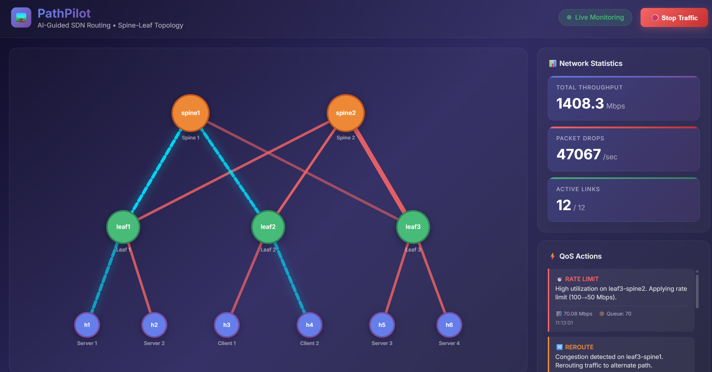

# 🛤️ PathPilot: AI-Guided Network Routing for Software-Defined Networks

<div align="center">

 
 
 
 


<br/>



**A Real-Time Machine Learning System for Intelligent Path Selection and QoS Management in Software-Defined Networks**

[Features](#-key-features) • [Architecture](#-system-architecture) • [Installation](#-installation--setup) • [Results](#-results--metrics)

</div>

---

## 📑 Table of Contents

1. [Abstract](#-abstract)
2. [Key Features](#-key-features)
3. [Network Topology](#-network-topology)
4. [System Architecture](#-system-architecture)
5. [ML Model Architecture](#-ml-model-architecture)
6. [QoS Management](#-qos-management)
7. [Installation & Setup](#-installation--setup)
8. [API Reference](#-api-reference)
9. [Results & Metrics](#-results--metrics)
10. [Project Structure](#-project-structure)

---

## 📄 Abstract

**PathPilot** is an intelligent traffic routing system that leverages **Machine Learning (LSTM neural networks)** to predict optimal network paths in real-time for Software-Defined Networks. The system monitors network telemetry, predicts link costs based on historical patterns, and dynamically routes traffic through the least congested path.

### Key Statistics

| Metric | Value |
|--------|-------|
| **Topology** | Spine-Leaf Data Center Architecture |
| **Nodes** | 11 (6 hosts + 3 leaf + 2 spine switches) |
| **Links** | 12 monitored connections |
| **ML Architecture** | 2-Layer LSTM (64 hidden units) |
| **Input Features** | 48 (12 links × 4 features each) |
| **QoS Actions** | 5 types (REROUTE, RATE_LIMIT, PRIORITY_QUEUE, DROP_EXCESS, SHAPE_TRAFFIC) |
| **Inference Latency** | <10ms per prediction |
| **Path Update Interval** | 2 seconds |

---

## ⭐ Key Features

### 🧠 ML-Powered Path Selection
| Component | Technology | Purpose |
|-----------|------------|---------|
| **LSTM Model** | PyTorch (2-layer, 64 hidden) | Time-series cost prediction |
| **Feature Extraction** | Custom pipeline | tx_bps, rx_bps, drops, queue |
| **Dijkstra Routing** | Heap-based shortest path | Optimal path computation |
| **Real-time Inference** | FastAPI server | <10ms prediction latency |

### 📊 Live Network Monitoring
- **Real-time Telemetry**: Throughput, packet drops, queue lengths
- **D3.js Visualization**: Interactive spine-leaf topology graph
- **Color-coded Links**: Visual congestion indicators (green → orange → red)
- **Animated Paths**: ML-predicted optimal routes with cyan flow animation

### 🔄 Advanced QoS Management (5 Action Types)
| Action | Trigger | Description |
|--------|---------|-------------|
| **REROUTE** | Packet drops detected | Switch traffic to alternate spine |
| **RATE_LIMIT** | Throughput > 70 Mbps | Throttle bandwidth on link |
| **PRIORITY_QUEUE** | Critical traffic detected | Prioritize important flows |
| **DROP_EXCESS** | Queue length > 80% | Drop low-priority packets |
| **SHAPE_TRAFFIC** | Burst detected (Δ > 50 Mbps) | Smooth traffic spikes |

### 🎨 Modern Dashboard
- **Glass-morphism UI**: Modern dark theme with blur effects
- **Live Statistics**: Total throughput, packet drops, active links
- **QoS Action Feed**: Real-time notifications with detailed metrics
- **Interactive Controls**: Traffic start/stop toggle

---

## 🏗️ Network Topology

### Spine-Leaf Architecture

PathPilot uses a **data center spine-leaf topology** - the gold standard architecture used by AWS, Google, and Azure.

```
                        ┌──────────────────────────────────────────┐
                        │          SPINE LAYER (Core)              │
                        │                                          │
                        │    ┌────[SPINE1]────┐ ┌────[SPINE2]────┐ │
                        │    │    (Orange)    │ │    (Orange)    │ │
                        │    └───────┬────────┘ └───────┬────────┘ │
                        │            │                  │          │
                        └────────────┼──────────────────┼──────────┘
                                     │   Full Mesh     │
                    ┌────────────────┴──────────────────┴────────────────┐
                    │                    LEAF LAYER                      │
                    │                                                    │
                    │   ┌────[LEAF1]────┐  ┌────[LEAF2]────┐  ┌────[LEAF3]────┐
                    │   │    (Green)    │  │    (Green)    │  │    (Green)    │
                    │   └───┬───────┬───┘  └───┬───────┬───┘  └───┬───────┬───┘
                    │       │       │          │       │          │       │
                    └───────┼───────┼──────────┼───────┼──────────┼───────┼───────┘
                            │       │          │       │          │       │
                    ┌───────┴───────┴──────────┴───────┴──────────┴───────┴───────┐
                    │                       HOST LAYER                            │
                    │                                                             │
                    │      [H1]    [H2]      [H3]     [H4]      [H5]     [H6]     │
                    │    Server1  Server2  Client1  Client2  Server3  Server4   │
                    │    (Purple) (Purple) (Purple) (Purple) (Purple) (Purple)  │
                    │                                                             │
                    └─────────────────────────────────────────────────────────────┘
```

### Link Inventory (12 Total)

| Link # | Connection | Type | Purpose |
|--------|------------|------|---------|
| 1-6 | Hosts → Leaf switches | Host-Leaf | Server/Client uplinks |
| 7-12 | Leaf → Spine switches | Leaf-Spine | Core mesh (full connectivity) |

### Traffic Flow Example

```
Client 1 (h3) → Server 1 (h1):

h3 ──→ LEAF2 ──→ SPINE1 or SPINE2 ──→ LEAF1 ──→ h1
                      ↑
        ML model decides based on predicted costs!
```

---

## 🏛️ System Architecture

```
┌─────────────────────────────────────────────────────────────────────────────────┐
│                           PathPilot System Architecture                          │
├─────────────────────────────────────────────────────────────────────────────────┤
│                                                                                  │
│  ┌─────────────────────────────────────────────────────────────────────────┐   │
│  │                         DATA PLANE                                       │   │
│  │  ┌─────────┐  ┌─────────┐  ┌─────────┐  ┌─────────┐  ┌─────────┐       │   │
│  │  │   h1    │  │   h2    │  │   h3    │  │   h4    │  │  h5/h6  │       │   │
│  │  └────┬────┘  └────┬────┘  └────┬────┘  └────┬────┘  └────┬────┘       │   │
│  │       └────────────┴────────────┴────────────┴────────────┘             │   │
│  │                              ↓                                           │   │
│  │       ┌──────────────────────────────────────────────────────┐          │   │
│  │       │  LEAF1  ←──→  SPINE1/SPINE2  ←──→  LEAF2/LEAF3      │          │   │
│  │       └──────────────────────────────────────────────────────┘          │   │
│  └─────────────────────────────────────────────────────────────────────────┘   │
│                                   ↓                                             │
│  ┌─────────────────────────────────────────────────────────────────────────┐   │
│  │                      STATS COLLECTION LAYER                              │   │
│  │                                                                          │   │
│  │    ┌───────────────┐      ┌────────────────┐      ┌─────────────────┐  │   │
│  │    │  POX + Link   │ ───→ │  pox_stats.json │ ───→ │  Stats Proxy    │  │   │
│  │    │  Stats Module │      │  (12 links)     │      │  (port 8001)    │  │   │
│  │    └───────────────┘      └────────────────┘      └────────┬────────┘  │   │
│  │                                                            │            │   │
│  │    Mock Simulation (Windows/macOS):                        │            │   │
│  │    ┌───────────────────┐                                   │            │   │
│  │    │ mock_simulation.py │ ─── Generates synthetic stats ───┘            │   │
│  │    └───────────────────┘                                                │   │
│  └─────────────────────────────────────────────────────────────────────────┘   │
│                                   ↓                                             │
│  ┌─────────────────────────────────────────────────────────────────────────┐   │
│  │                         ML PIPELINE                                      │   │
│  │                                                                          │   │
│  │  ┌──────────────┐    ┌──────────────┐    ┌──────────────┐               │   │
│  │  │   Features   │───→│    LSTM      │───→│   Dijkstra   │               │   │
│  │  │  Extraction  │    │   Model      │    │   Routing    │               │   │
│  │  │  (48 dims)   │    │ (2-layer,64) │    │              │               │   │
│  │  └──────────────┘    └──────────────┘    └──────┬───────┘               │   │
│  │                                                  │                       │   │
│  │                                                  ▼                       │   │
│  │  ┌──────────────────────────────────────────────────────────────────┐  │   │
│  │  │  ML Server (FastAPI, port 9000)                                   │  │   │
│  │  │  GET /predict → {"path": ["h1","leaf1","spine2","leaf2","h4"]}   │  │   │
│  │  └──────────────────────────────────────────────────────────────────┘  │   │
│  └─────────────────────────────────────────────────────────────────────────┘   │
│                                   ↓                                             │
│  ┌─────────────────────────────────────────────────────────────────────────┐   │
│  │                       VISUALIZATION LAYER                                │   │
│  │                                                                          │   │
│  │  ┌──────────────────────────────────────────────────────────────────┐  │   │
│  │  │  visualizer.html (D3.js)                                          │  │   │
│  │  │  • Spine-Leaf topology rendering                                  │  │   │
│  │  │  • Live throughput/drops/queue stats                             │  │   │
│  │  │  • QoS Action feed (5 action types)                              │  │   │
│  │  │  • ML-predicted path animation                                    │  │   │
│  │  └──────────────────────────────────────────────────────────────────┘  │   │
│  └─────────────────────────────────────────────────────────────────────────┘   │
│                                                                                  │
└─────────────────────────────────────────────────────────────────────────────────┘
```

---

## 🧠 ML Model Architecture

### QoSLSTM Neural Network

```python
class QoSLSTM(nn.Module):
    def __init__(self, num_links=12, hidden=64):
        super().__init__()
        
        self.lstm = nn.LSTM(
            input_size=num_links * 4,    # 48 features
            hidden_size=hidden,           # 64 hidden units
            num_layers=2,                 # 2 stacked layers
            batch_first=True
        )
        
        self.fc = nn.Linear(hidden, num_links)  # 12 cost outputs
    
    def forward(self, x):
        out, _ = self.lstm(x)
        return self.fc(out[:, -1, :])  # Last timestep output
```

### Data Flow

```
┌─────────────────────────────────────────────────────────────────────┐
│  INPUT: Network Telemetry (10-second sliding window)                │
│  Shape: [batch, 10 timesteps, 48 features]                          │
│                                                                      │
│  Features per link (×12 links):                                      │
│  ┌──────────┬──────────┬──────────────┬────────────┐                │
│  │ tx_bps   │ rx_bps   │ tx_dropped   │ queue_len  │                │
│  │ (Mbps)   │ (Mbps)   │ (normalized) │(normalized)│                │
│  └──────────┴──────────┴──────────────┴────────────┘                │
└─────────────────────────────────────────────────────────────────────┘
                              │
                              ▼
┌─────────────────────────────────────────────────────────────────────┐
│  LSTM Layer 1: input=48, hidden=64                                   │
│  • Learns short-term patterns in traffic                             │
└─────────────────────────────────────────────────────────────────────┘
                              │
                              ▼
┌─────────────────────────────────────────────────────────────────────┐
│  LSTM Layer 2: input=64, hidden=64                                   │
│  • Captures longer-term dependencies                                 │
│  • "High traffic at t=5 → congestion at t=10"                       │
└─────────────────────────────────────────────────────────────────────┘
                              │
                              ▼ (last timestep only)
┌─────────────────────────────────────────────────────────────────────┐
│  Fully Connected: 64 → 12                                            │
│  Output: Predicted cost for each of the 12 links                     │
└─────────────────────────────────────────────────────────────────────┘
                              │
                              ▼
┌─────────────────────────────────────────────────────────────────────┐
│  OUTPUT: [h1-leaf1, h2-leaf1, h3-leaf2, h4-leaf2, h5-leaf3,         │
│           h6-leaf3, leaf1-spine1, leaf1-spine2, leaf2-spine1,       │
│           leaf2-spine2, leaf3-spine1, leaf3-spine2]                  │
│                                                                      │
│  Lower cost = Better path                                            │
└─────────────────────────────────────────────────────────────────────┘
```

### Training Configuration

| Parameter | Value |
|-----------|-------|
| Optimizer | Adam |
| Learning Rate | 0.001 |
| Loss Function | MSE (Mean Squared Error) |
| Epochs | 30 |
| Gradient Clipping | 1.0 |
| Sequence Length | 10 timesteps |

---

## 🔄 QoS Management

### QoS Action Types

| Type | Icon | Trigger Condition | Action Taken |
|------|------|-------------------|--------------|
| **REROUTE** | 🔀 | `tx_dropped > 0` | Switch to alternate spine path |
| **RATE_LIMIT** | ⏱️ | `tx_bps > 70 Mbps` | Throttle to 50 Mbps |
| **PRIORITY_QUEUE** | ⬆️ | Critical traffic detected | Enable QoS queuing |
| **DROP_EXCESS** | 🗑️ | `queue_len > 80` | Drop low-priority packets |
| **SHAPE_TRAFFIC** | 📐 | Burst detected | Apply traffic shaping |

### QoS Action Format

```json
{
  "type": "RATE_LIMIT",
  "message": "High utilization on leaf1-spine1. Applying rate limit (100→50 Mbps).",
  "timestamp": 1705234567.123,
  "details": {
    "link": "leaf1-spine1",
    "throughput_mbps": 95.67,
    "drops": 127,
    "queue_len": 85
  }
}
```

---

## 🚀 Installation & Setup

### Prerequisites

| Requirement | Version | Purpose |
|-------------|---------|---------|
| Python | 3.8+ | Backend & ML |
| PyTorch | 2.0+ | LSTM model |
| Mininet | 2.3+ | Network emulation (Linux/WSL only) |
| POX | Latest | SDN controller (Linux/WSL only) |

### Quick Start (Windows/macOS - Mock Mode)

```bash
# Clone repository
git clone https://github.com/yourusername/PathPilot.git
cd PathPilot

# Install dependencies
pip install torch numpy fastapi uvicorn requests

# Terminal 1: Start mock traffic simulation
cd visualiser
python mock_simulation.py

# Terminal 2: Start stats proxy
cd visualiser
python proxy.py

# Terminal 3: Start ML server
cd ml
uvicorn ml-server:app --host 0.0.0.0 --port 9000

# Open visualizer in browser
# Open: visualiser/visualizer.html
```

### Full Setup (Linux/WSL - With Mininet)

```bash
# Install Mininet & POX
sudo apt install mininet
git clone https://github.com/noxrepo/pox.git ~/pox

# Start POX controller
cd ~/pox
./pox.py openflow.discovery ext.linkstats

# Start Mininet topology
cd PathPilot/visualiser
sudo mn --custom multipath.py --topo spineleaf --controller=remote

# Start services (same as above)
python proxy.py
cd ../ml && uvicorn ml-server:app --port 9000
```

---

## 📡 API Reference

### Stats Proxy (`http://localhost:8001`)

#### GET `/stats`
Returns current stats for all 12 links.

```json
{
  "h1-leaf1": {"tx_bps": 45000000, "rx_bps": 44000000, "tx_dropped": 0, "queue_len": 12},
  "leaf1-spine1": {"tx_bps": 85000000, "rx_bps": 82000000, "tx_dropped": 127, "queue_len": 78},
  ...
}
```

#### GET `/qos-actions`
Returns recent QoS action log.

#### POST `/toggle-traffic`
Start/stop traffic generation.

### ML Server (`http://localhost:9000`)

#### GET `/`
Returns server info.
```json
{
  "service": "PathPilot ML Server",
  "version": "2.0",
  "topology": "Spine-Leaf",
  "num_links": 12,
  "mode": "mock"
}
```

#### GET `/predict`
Returns ML-predicted optimal path.
```json
{
  "status": "ready",
  "path": ["h1", "leaf1", "spine2", "leaf2", "h4"],
  "costs": {
    "h1-leaf1": 0.45,
    "leaf1-spine1": 2.15,
    "leaf1-spine2": 0.42,
    ...
  },
  "mode": "mock"
}
```

#### GET `/topology`
Returns topology information.

#### GET `/health`
Health check endpoint.

---

## 📊 Results & Metrics

### Network Statistics (Live)

| Metric | Typical Range |
|--------|---------------|
| **Total Throughput** | 500 - 1500 Mbps |
| **Packet Drops** | 0 - 50,000 /sec |
| **Active Links** | 12 / 12 |
| **QoS Actions/min** | 5 - 20 |

### ML Performance

| Metric | Value |
|--------|-------|
| Inference Latency | < 10ms |
| Path Update Interval | 2 seconds |
| Feature Extraction | < 1ms |
| Model Size | ~235 KB |

---

## 📁 Project Structure

```
PathPilot/
├── README.md                    # This file
├── commands.txt                 # Quick reference commands
│
├── ml/                          # Machine Learning Pipeline
│   ├── model.py                 # LSTM model definition
│   ├── train.py                 # Training script
│   ├── ml-server.py             # FastAPI prediction server (port 9000)
│   ├── features.py              # Feature extraction (48 dimensions)
│   ├── routing.py               # Dijkstra shortest path
│   ├── topology.py              # Spine-leaf topology definition
│   ├── dataset_builder.py       # Training data collection
│   ├── dataset.npz              # Collected training data
│   └── model.pt                 # Trained LSTM weights
│
└── visualiser/                  # Visualization & Simulation
    ├── visualizer.html          # D3.js interactive dashboard
    ├── proxy.py                 # Stats API proxy (port 8001)
    ├── multipath.py             # Mininet spine-leaf topology
    ├── mock_simulation.py       # Simulation with 5 QoS types
    ├── topology.json            # Topology data for visualizer
    ├── pox_stats.json           # Real-time stats (generated)
    ├── qos_actions.json         # QoS action log (generated)
    └── traffic_control.json     # Traffic toggle state
```

---

## 🎓 Academic Context

This project demonstrates:

1. **Software-Defined Networking (SDN)** - Centralized control plane with OpenFlow
2. **Machine Learning for Networks** - LSTM for time-series prediction
3. **Data Center Architecture** - Spine-leaf topology design
4. **Quality of Service (QoS)** - Proactive traffic management
5. **Real-time Visualization** - D3.js network monitoring

---

## 📜 License

MIT License - Feel free to use for academic and research purposes.

---

<div align="center">

**Built with ❤️ for SDN Research**

</div>
